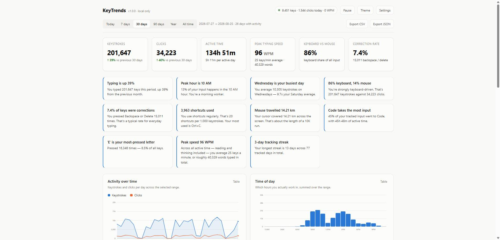
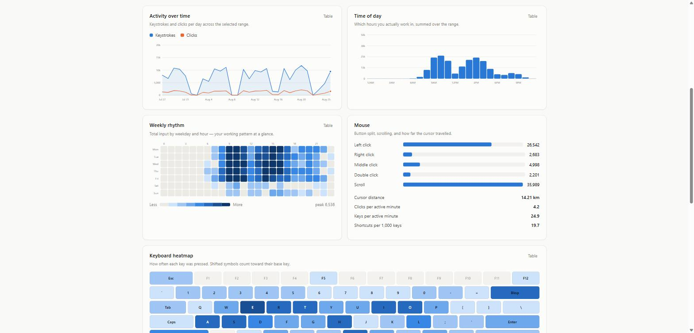
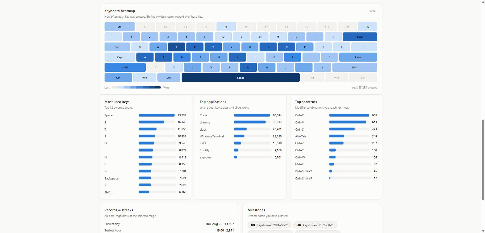
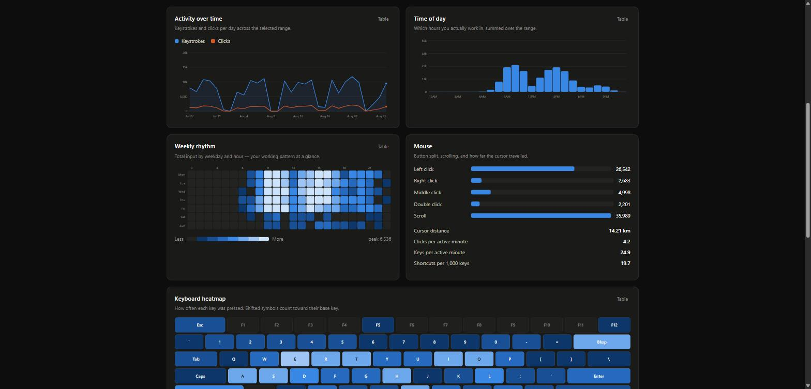

<div align="center">

# KeyTrends

**Local keyboard and mouse analytics for Windows.**
Counts and trends — never the text you type.

[](https://www.python.org/)
[](#)
[](LICENSE)
[](#what-it-records--and-what-it-does-not)

</div>

A small tracker sits in your system tray, counts what you type and click, and a
local browser dashboard turns those counts into trends — peak hours, weekly
rhythm, a keyboard heatmap, typing speed, shortcut habits, streaks and milestones.

Everything stays on your PC. There is no account, no server, and no network call.



---

## Contents

- [What it records — and what it does not](#what-it-records--and-what-it-does-not)
- [Screenshots](#screenshots)
- [Install](#install)
- [Run](#run)
- [The dashboard](#the-dashboard)
- [How it works](#how-it-works)
- [Project layout](#project-layout)
- [Development](#development)
- [Responsible use](#responsible-use)
- [License](#license)

---

## What it records — and what it does not

**It records counts, not content.**

| Recorded | Not recorded |
|---|---|
| How many times each key was pressed **per day** | The order you pressed keys in |
| Clicks per button, double clicks, scrolls | Anything you typed — words, passwords, messages |
| Cursor travel distance | Screen contents or screenshots |
| Which application had focus | Window titles or URLs |
| Active (non-idle) seconds per hour | Anything while tracking is paused |

Because only per-day totals are stored, the database holds no sequence
information and cannot reconstruct text. The keyboard heatmap knows you pressed
`E` 16,346 times last month; it has no idea which words those were.

Modifier keys are recorded for the heatmap but deliberately excluded from the
keystroke total — a Shift press isn't a typed character.

**Privacy controls**, all in Settings: pause tracking, turn off per-key detail,
turn off application attribution, exclude specific apps entirely (your password
manager, remote desktop, banking), and delete all data.

Your data lives in `%LOCALAPPDATA%\KeyTrends\` as a plain SQLite file you can
open, export, or delete at any time.

---

## Screenshots

<details open>
<summary><b>Charts and heatmaps</b></summary>



</details>

<details>
<summary><b>Keyboard heatmap and top lists</b></summary>



</details>

<details>
<summary><b>Dark theme</b></summary>



</details>

---

## Install

Requires **Python 3.10+** on **Windows**.

```bat
git clone https://github.com/faizanzafar40/KeyTrends.git
cd KeyTrends
setup.bat
```

`setup.bat` creates a virtual environment and installs the dependencies. To do it
by hand:

```bat
python -m venv .venv
.venv\Scripts\python.exe -m pip install -r requirements.txt
```

## Run

```bat
KeyTrends.bat
```

The tray icon appears and the dashboard opens at <http://127.0.0.1:8731>.
Right-click the tray icon for live counters, pause, and autostart.

### Command line

```bat
python run.py                # tray + dashboard
python run.py --background   # start silently (used by autostart)
python run.py --no-tray      # run in a console instead
python run.py --paused       # start with tracking paused
python run.py --port 9000    # use a different port
```

### Try it without waiting three months

```bat
python tools\seed_demo.py --serve
```

This generates 90 days of realistic synthetic activity in a separate `demo-data\`
directory and opens the dashboard on it. Your real statistics are untouched.

### Start with Windows

Turn on **Start with Windows** in Settings (or the tray menu). It writes a
per-user entry to `HKCU\Software\Microsoft\Windows\CurrentVersion\Run` — no admin
rights, and it only affects your account. Turning it off removes the entry.

---

## The dashboard

One filter row at the top (Today / 7 / 30 / 90 days / Year / All time) scopes
every panel below it.

- **Headline tiles** — keystrokes, clicks, active time, peak WPM,
  keyboard-vs-mouse split and correction rate, each with change against the
  previous equal-length period.
- **Insights** — plain-language findings generated from your data: whether typing
  is up or down, your peak hour and chronotype, your busiest weekday, shortcut
  habits, cursor distance (with a human-scale comparison), most-pressed letter.
- **Activity over time** — keystrokes and clicks per day.
- **Time of day** — which hours you actually work in.
- **Weekly rhythm** — a weekday × hour heatmap of total input.
- **Keyboard heatmap** — a QWERTY layout shaded by press count. Shifted symbols
  count toward their base key.
- **Mouse** — button split, scrolls, cursor distance, per-minute rates.
- **Top keys / applications / shortcuts.**
- **Records & streaks**, and lifetime **milestones**.

Every chart has a **Table** toggle showing the same numbers as text, and the page
follows your system light/dark theme (the Theme button cycles
system → light → dark).

**Export CSV** gives one row per day. **Export JSON** gives the full breakdown —
summary, daily series, hourly profile, per-key counts, shortcuts, apps, records
and streaks — for the selected range.

---

## How it works

```
pynput global hooks  ──►  in-memory counters  ──►  SQLite aggregates
   (keyboard/mouse)        (flushed every 5s)       (hourly + per-day)
                                                          │
                                      Flask API  ◄─────────┘
                                          │
                                    browser dashboard
```

A few details that make the numbers trustworthy:

- **Auto-repeat is suppressed** — holding a key down counts once, not fifty times.
- **Active time** is counted a second at a time and only while Windows reports
  input within the last 60 seconds, so idle time doesn't inflate your averages.
- **Typing speed** uses a rolling 60-second window normalised by the real elapsed
  span, so short bursts read honestly and the number decays when you stop typing.
- **Cursor teleports** (monitor switches, remote desktop jumps) are ignored so
  they don't distort travel distance.
- **Shift alone is not a shortcut** — only Ctrl/Alt/Win combinations count.
- The dashboard binds to `127.0.0.1` only and is never exposed to your network.
- The charts are hand-rolled SVG with **no JavaScript dependencies**, so the
  dashboard works with no internet connection at all.

---

## Project layout

| Path | Purpose |
|---|---|
| `keytrends/tracker.py` | Global hooks, counting, buffering, milestones |
| `keytrends/db.py` | SQLite schema and all analytics queries |
| `keytrends/insights.py` | Derived metrics and the narrative insights |
| `keytrends/server.py` | Flask dashboard and JSON API |
| `keytrends/tray.py` | System tray icon and menu |
| `keytrends/autostart.py` | Windows login registration |
| `keytrends/winapi.py` | Idle detection and active-window lookup |
| `keytrends/static/js/charts.js` | Dependency-free SVG charts |
| `tools/seed_demo.py` | Synthetic data generator for demos and screenshots |
| `tests/test_tracker.py` | Behaviour tests for the counting logic |

---

## Development

Run the test suite — it feeds synthetic events straight into the listener
callbacks, so no real input is needed and nothing touches your database:

```bat
.venv\Scripts\python.exe tests\test_tracker.py
```

It covers auto-repeat suppression, the Shift-vs-shortcut distinction,
double-click detection, cursor teleport filtering, application attribution,
unflushed live counts, and pause.

Set `KEYTRENDS_DATA_DIR` to point the app at a different data directory — handy
for testing against throwaway databases.

### Known limitations

- **Windows only.** The tray, autostart, active-window and idle detection use
  Win32 APIs. The tracker and dashboard would need a platform shim elsewhere.
- Cursor distance assumes a 96-DPI display when converting pixels to metres.
- Applications running **as administrator** don't deliver input events to a
  normal-privilege listener, so activity inside them may go uncounted.
- Antivirus tools sometimes flag global keyboard hooks. All the tracking code is
  in `keytrends/tracker.py` if you or your IT team want to read exactly what it does.
- The dashboard uses Flask's development server. That is deliberate — it is bound
  to localhost and serves a single local user.

---

## Responsible use

KeyTrends is a quantified-self tool, meant to be run by you, on your own machine,
to look at your own habits. Installing it on someone else's computer, or on a
shared or work machine without clear consent, is very likely illegal where you
live. Don't.

The design reflects that intent: aggregate counts only, no text capture, no
network transmission, visible tray presence, and a one-click delete.

---

## License

[MIT](LICENSE) © Faizan Zafar
